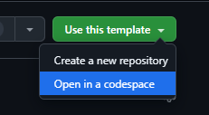
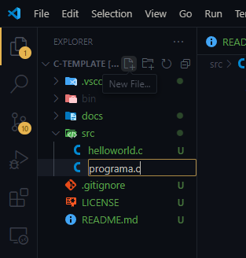
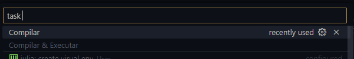
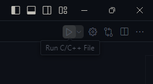
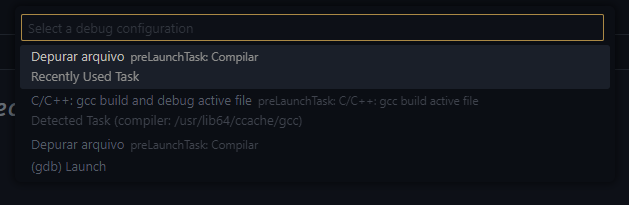
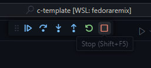

# Programação em C

Repositório modelo configurado para programação na linguagem C usando o Github Codespaces. Para criar
uma cópia desse repositório na nuvem, clique no
botão `Use this template` e selecione a opção
`Open in a codespace`.



## Estrutura

```
.vscode/  -- arquivos de configuração (não altere se não souber o que estiver fazendo)
bin/      -- onde os arquivos compilados ficam (ignore)
src/      -- diretório dos arquivos de código
docs/     -- aquivos que não sejam código (ex: imagens, documentos, etc)
```

## Criando novos arquivos

Na barra lateral, você pode criar novos arquivos ou pastas
clicando no ícone correspondente na parte superior:



## Compilando/Executando

Abra o arquivo que queira executar/compilar e pressione as
teclas <kbd>CTRL</kbd> + <kbd>P</kbd> e digite `task` na barra
de pesquisa. Você verá a opção **Compilar & Executar**, use as
setas do teclado + <kbd>ENTER</kbd> ou clique com o mouse para executar a tarefa.




> Alternativamente, você pode pressionar as teclas <kbd>CTRL</kbd> + <kbd>SHIFT</kbd> + <kbd>B</kbd> com o arquivo aberto.

## Depurando

Para a depuração funcionar, é necessário a instalação da extensão [ms-vscode.cpptools](https://marketplace.visualstudio.com/items?itemName=ms-vscode.cpptools).
Use <kbd>CTRL</kbd> + <kbd>P</kbd> e digite o comando:

```
ext install ms-vscode.cpptools
```

Com a extensão instalada, abra o arquivo que queira depurar e pressione
<kbd>F5</kbd>. Se esse atalho não funcionar no seu navegador, você pode
usar os ícones na barra superior da interface:



Selecione a opção `Depurar Arquivo`.



Clique no botão vermelho para sair do modo de depuração.



## Atalhos

- <kbd>CTRL</kbd> + <kbd>P</kbd>: abre o input de comandos.
- <kbd>CTRL</kbd> + <kbd>S</kbd>: salva o arquivo aberto.
- <kbd>CTRL</kbd> + <kbd>B</kbd>: abre/fecha a barra lateral.
- <kbd>CTRL</kbd> + <kbd>'</kbd>: abre/fecha o terminal.
- <kbd>CTRL</kbd> + <kbd>SHIFT</kbd> + <kbd>B</kbd>: compila e executa o arquivo aberto.
- <kbd>F5</kbd>: compila e executa o arquivo aberto em modo de depuração.
- <kbd>SHIFT</kbd> + <kbd>F5</kbd>: sai do modo de depuração.

## Ajuda adicional


- [Documentação](https://code.visualstudio.com/docs) do Visual Studio Code.
- [Extensão C/C++](https://marketplace.visualstudio.com/items?itemName=ms-vscode.cpptools) para Visual Studio Code.
- Aprender C (inglês) : [w3schools](https://www.w3schools.com/c/)
