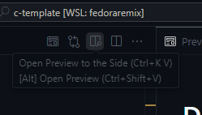

# Documentando

Você pode utilizar arquivos [Markdown](https://www.markdownguide.org/)
para documentar o seu código. Arquivos mardown terminam
com a extensão `.md`.

Você pode ver um documento markdown renderizado utilizando
o botão de *preview* na barra superior do editor:



## Sintaxe

### Títulos e subtítulos

Use `#` para criar títulos e seções no documento.

Exemplo:

```md
# Título
## Subtítulo
### Subseção
```

**Resultado:**

# Título
## Subtítulo
### Subseção

----

### Formatação básica

- Utilize `*texto*` para formatar um `texto` em *itálico*.
- Utilize `**texto**` para formatar um `texto` em **negrito**.
- Utilize `~~texto~~` para formatar um `texto` ~~cortado~~.

Exemplo:

```md
Lorem *ipsum* dolor sit amet **consectetur** adipisicing ~~elit~~
```

Resultado:

Lorem *ipsum* dolor sit amet **consectetur** adipisicing ~~elit~~


### Incluindo código

Você pode incluir trechos de códigos da seguinte forma:

~~~md
```<linguagem>
Meu código aqui
```
~~~

Onde `<linguagem>` é a linguagem do código.

Por exemplo, podemos colocar um trecho de código C dessa forma:

~~~md
```c
#include <stdio.h>

int main()
{
    printf("Hello, world!\n");
    return 0;
}
```
~~~

Que resulta em:

```c
#include <stdio.h>

int main()
{
    printf("Hello, world!\n");
    return 0;
}
```

## Referências

- Sintaxe e definição de documentos markdown: https://www.markdownguide.org/basic-syntax/.
